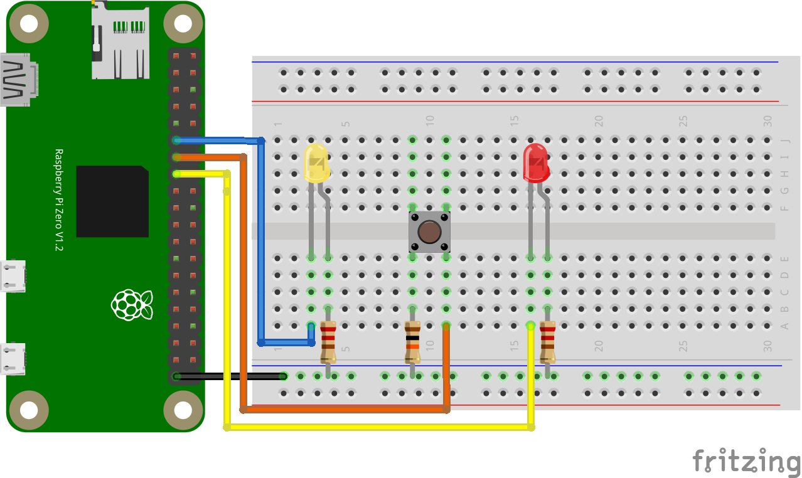

# Example

Example of driving GPIOs via the character device driver.

This example provides switching between two LEDs via a button. When the button
is not press `:led1` will be active and when the button is pressed `:led2` will
be active.

By default this will try to use `gpiochip0` for the GPIO device. `:led1` will be
set to line `17` and `:led2` will be set to line `22`. The button events will be
sent to line `27`. This defaults should work for Raspberry PI based systems.
However, if you need to configure the system you can in the `target.exs` file
like:

```elixir
config :example,
  config: [
    chip: <chip_name>,
    led1: <led1_line_number>
    led2: <led2_line_number>,
    button: <button_line_number>
  ]
```



## Notes

In the latest Nerves system the character device driver will not work, so this
example ensures that we use the `1.13` series systems to make sure the Linux
headers support the GPIO character driver. Once the Nerves systems update to a
capable Linux header version this project will be updated.

## Targets

Nerves applications produce images for hardware targets based on the
`MIX_TARGET` environment variable. If `MIX_TARGET` is unset, `mix` builds an
image that runs on the host (e.g., your laptop). This is useful for executing
logic tests, running utilities, and debugging. Other targets are represented by
a short name like `rpi3` that maps to a Nerves system image for that platform.
All of this logic is in the generated `mix.exs` and may be customized. For more
information about targets see:

https://hexdocs.pm/nerves/targets.html#content

## Getting Started

To start your Nerves app:
  * `export MIX_TARGET=my_target` or prefix every command with
    `MIX_TARGET=my_target`. For example, `MIX_TARGET=rpi3`
  * Install dependencies with `mix deps.get`
  * Create firmware with `mix firmware`
  * Burn to an SD card with `mix firmware.burn`

## Learn more

  * Official docs: https://hexdocs.pm/nerves/getting-started.html
  * Official website: https://nerves-project.org/
  * Forum: https://elixirforum.com/c/nerves-forum
  * Discussion Slack elixir-lang #nerves ([Invite](https://elixir-slackin.herokuapp.com/))
  * Source: https://github.com/nerves-project/nerves
